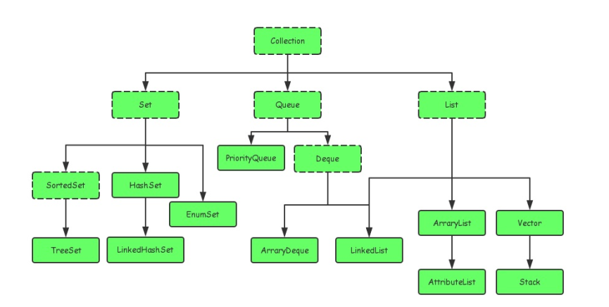

## Java 集合
###一、 简介

Java集合大致可以分为Set、List、Queue和Map四种体系。
其中Set代表无序、不可重复的集合；List代表有序、重复的集合；而Map则代表具
有映射关系的集合。Java 5 又增加了Queue体系集合，代表一种队列集合实现。
Java集合就像一种容器，可以把多个对象（实际上是对象的引用，但习惯上都称对
象） “丢进”该容器中。从Java 5 增加了泛型以后，Java集合可以记住容器中对象的
数据类型，使得编码更加简洁、健壮。

###二、继承关系

Map实现类用于保存具有映射关系的数据。Map保存的每项数据都是key-value对，
也就是由key和value两个值组成。Map里的key是不可重复的，key用户标识集合里
的每项数据。

###